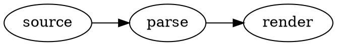

# Graphviz Diagram Preview

Adds Graphviz (DOT) support to VS Code's built-in Markdown preview.

> Work in progress: the extension scaffold is in place; rendering is not wired yet.

Write DOT source in a fence tagged `graphviz`:

````markdown

````

Only `graphviz` fences are claimed — `dot` fences are left to other renderers.
To use another layout engine, set it inside the source, e.g. `layout=neato`.

## Fonts

Graphviz measures text with built-in width tables, so labels fit their shapes
only for these families: Times / Times New Roman, Helvetica / Arial,
Courier / Courier New, DejaVu Sans, Consolas, Nunito, Trebuchet. Other fonts are
measured as Times, and a warning is written to the *Graphviz Diagram Preview*
output channel. Name a single family — a CSS-style list such as
`fontname="Helvetica,Arial,sans-serif"` or a generic family such as `sans-serif`
is measured as Times.

## License

MIT for this extension; bundled Graphviz is EPL-2.0 — see
[THIRD_PARTY_NOTICES.md](THIRD_PARTY_NOTICES.md).
