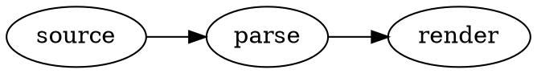

# Graphviz Diagram Preview

Adds Graphviz (DOT) support to VS Code's built-in Markdown preview.

Write DOT source in a fence tagged `graphviz`:

````markdown

````

Only `graphviz` fences are claimed — `dot` fences are left to other renderers.
To use another layout engine, set it inside the source, e.g. `layout=neato`.

## Fence attributes

An optional attribute block after the tag adjusts how one diagram is presented:

````markdown
```graphviz {alt="Three stages, left to right" caption="Figure 1: Pipeline" align="center"}
digraph { rankdir=LR; source -> parse -> render }
```
````

| Attribute | Effect |
|---|---|
| `alt` | Description for readers who cannot see the diagram (`role="img"` + `aria-label`) |
| `caption` | Text shown beneath the diagram |
| `align` | `left`, `center` or `right` |
| `class` | Extra CSS class on the diagram's `<svg>` |

Values are quoted. A mistyped or malformed attribute never costs you the diagram:
it is ignored, and a note is written to the *Graphviz Diagram Preview* output
channel.

## Errors and limits

A DOT syntax error is shown in place of the diagram, with the offending source line.
Layout is limited to 3 seconds per diagram and 64 KB of source; a graph that takes
longer shows a timeout message until its source changes. Graphviz warnings (unknown
shapes, fonts without metrics) go to the output channel.

Links (`URL`, `href`) work for `http:`, `https:` and `mailto:` and keep their
tooltips; other links are removed but the node stays. Images (`image=`,
``) are not supported. The extension reads no files, so it works fully in
Restricted Mode and virtual workspaces.

## Fonts

Graphviz measures text with built-in width tables, so labels fit their shapes
only for these families: Times / Times New Roman, Helvetica / Arial,
Courier / Courier New, DejaVu Sans, Consolas, Nunito, Trebuchet. Other fonts are
measured as Times, and a warning is written to the *Graphviz Diagram Preview*
output channel. Name a single family — a CSS-style list such as
`fontname="Helvetica,Arial,sans-serif"` or a generic family such as `sans-serif`
is measured as Times.

## License

MIT for this extension; bundled Graphviz is EPL-2.0 — see
[THIRD_PARTY_NOTICES.md](THIRD_PARTY_NOTICES.md).
