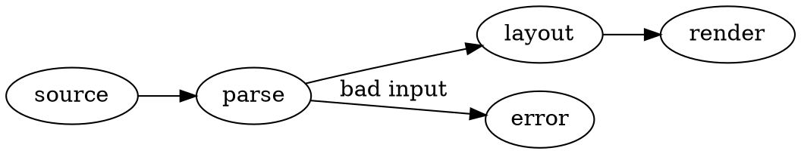
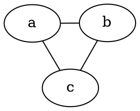
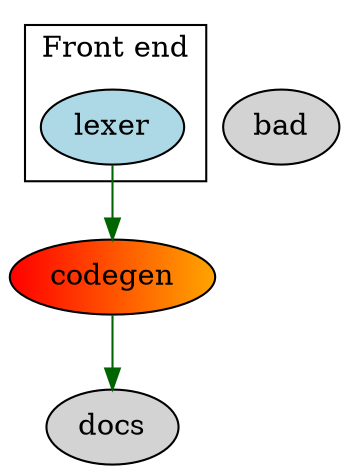
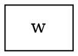
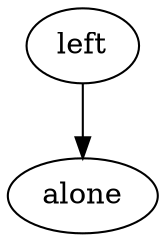

# Graphviz Diagram Preview — verification document

Open this file's preview (`⇧⌘V` or *Open Preview to the Side*) and compare with
the expectations in each section.

## 1. Defaults

Expect: a padded, rounded white card with black nodes and edges.



## 2. Neato layout, set inside the source

Expect: a triangle, not a top-down hierarchy.



## 3. Attributes

Expect: centred, with the caption beneath; hovering does not show "algin".

```graphviz {alt="Two nodes" caption="Figure 3: a caption" align="center" algin="typo"}
digraph { a -> b }
```

## 4. Colours, gradients, a link and a tooltip

Expect: author colours unchanged; *codegen* is a red→orange gradient; hovering
*docs* shows "Graphviz docs" and clicking it asks to open graphviz.org;
*bad* renders but is not a link.



## 5. Syntax error

Expect: a warning-bordered box quoting `syntax error in line 2` and the line
`2 │   x -> ;`; this section's heading and the next section still render.

```graphviz
digraph {
  x -> ;
}
```

## 6. Timeout

Expect: after about 3 seconds, "Graphviz layout took longer than 3 s. Simplify or
split the graph." Every other diagram on the page still renders.

```graphviz
digraph {
  n0 -> n13; n0 -> n26; n0 -> n39; n0 -> n52; n0 -> n65; n0 -> n78; n0 -> n91; n0 -> n104; n1 -> n20; n1 -> n33;
  n1 -> n46; n1 -> n59; n1 -> n72; n1 -> n85; n1 -> n98; n1 -> n111; n2 -> n27; n2 -> n40; n2 -> n53; n2 -> n66;
  n2 -> n79; n2 -> n92; n2 -> n105; n2 -> n118; n3 -> n34; n3 -> n47; n3 -> n60; n3 -> n73; n3 -> n86; n3 -> n99;
  n3 -> n112; n3 -> n125; n4 -> n41; n4 -> n54; n4 -> n67; n4 -> n80; n4 -> n93; n4 -> n106; n4 -> n119; n4 -> n132;
  n5 -> n48; n5 -> n61; n5 -> n74; n5 -> n87; n5 -> n100; n5 -> n113; n5 -> n126; n5 -> n139; n6 -> n55; n6 -> n68;
  n6 -> n81; n6 -> n94; n6 -> n107; n6 -> n120; n6 -> n133; n6 -> n146; n7 -> n62; n7 -> n75; n7 -> n88; n7 -> n101;
  n7 -> n114; n7 -> n127; n7 -> n140; n7 -> n153; n8 -> n69; n8 -> n82; n8 -> n95; n8 -> n108; n8 -> n121; n8 -> n134;
  n8 -> n147; n8 -> n160; n9 -> n76; n9 -> n89; n9 -> n102; n9 -> n115; n9 -> n128; n9 -> n141; n9 -> n154; n9 -> n167;
  n10 -> n83; n10 -> n96; n10 -> n109; n10 -> n122; n10 -> n135; n10 -> n148; n10 -> n161; n10 -> n174; n11 -> n90; n11 -> n103;
  n11 -> n116; n11 -> n129; n11 -> n142; n11 -> n155; n11 -> n168; n11 -> n181; n12 -> n97; n12 -> n110; n12 -> n123; n12 -> n136;
  n12 -> n149; n12 -> n162; n12 -> n175; n12 -> n188; n13 -> n104; n13 -> n117; n13 -> n130; n13 -> n143; n13 -> n156; n13 -> n169;
  n13 -> n182; n13 -> n195; n14 -> n111; n14 -> n124; n14 -> n137; n14 -> n150; n14 -> n163; n14 -> n176; n14 -> n189; n14 -> n202;
  n15 -> n118; n15 -> n131; n15 -> n144; n15 -> n157; n15 -> n170; n15 -> n183; n15 -> n196; n15 -> n209; n16 -> n125; n16 -> n138;
  n16 -> n151; n16 -> n164; n16 -> n177; n16 -> n190; n16 -> n203; n16 -> n216; n17 -> n132; n17 -> n145; n17 -> n158; n17 -> n171;
  n17 -> n184; n17 -> n197; n17 -> n210; n17 -> n223; n18 -> n139; n18 -> n152; n18 -> n165; n18 -> n178; n18 -> n191; n18 -> n204;
  n18 -> n217; n18 -> n230; n19 -> n146; n19 -> n159; n19 -> n172; n19 -> n185; n19 -> n198; n19 -> n211; n19 -> n224; n19 -> n237;
  n20 -> n153; n20 -> n166; n20 -> n179; n20 -> n192; n20 -> n205; n20 -> n218; n20 -> n231; n20 -> n244; n21 -> n160; n21 -> n173;
  n21 -> n186; n21 -> n199; n21 -> n212; n21 -> n225; n21 -> n238; n21 -> n251; n22 -> n167; n22 -> n180; n22 -> n193; n22 -> n206;
  n22 -> n219; n22 -> n232; n22 -> n245; n22 -> n258; n23 -> n174; n23 -> n187; n23 -> n200; n23 -> n213; n23 -> n226; n23 -> n239;
  n23 -> n252; n23 -> n265; n24 -> n181; n24 -> n194; n24 -> n207; n24 -> n220; n24 -> n233; n24 -> n246; n24 -> n259; n24 -> n272;
  n25 -> n188; n25 -> n201; n25 -> n214; n25 -> n227; n25 -> n240; n25 -> n253; n25 -> n266; n25 -> n279; n26 -> n195; n26 -> n208;
  n26 -> n221; n26 -> n234; n26 -> n247; n26 -> n260; n26 -> n273; n26 -> n286; n27 -> n202; n27 -> n215; n27 -> n228; n27 -> n241;
  n27 -> n254; n27 -> n267; n27 -> n280; n27 -> n293; n28 -> n209; n28 -> n222; n28 -> n235; n28 -> n248; n28 -> n261; n28 -> n274;
  n28 -> n287; n28 -> n0; n29 -> n216; n29 -> n229; n29 -> n242; n29 -> n255; n29 -> n268; n29 -> n281; n29 -> n294; n29 -> n7;
  n30 -> n223; n30 -> n236; n30 -> n249; n30 -> n262; n30 -> n275; n30 -> n288; n30 -> n1; n30 -> n14; n31 -> n230; n31 -> n243;
  n31 -> n256; n31 -> n269; n31 -> n282; n31 -> n295; n31 -> n8; n31 -> n21; n32 -> n237; n32 -> n250; n32 -> n263; n32 -> n276;
  n32 -> n289; n32 -> n2; n32 -> n15; n32 -> n28; n33 -> n244; n33 -> n257; n33 -> n270; n33 -> n283; n33 -> n296; n33 -> n9;
  n33 -> n22; n33 -> n35; n34 -> n251; n34 -> n264; n34 -> n277; n34 -> n290; n34 -> n3; n34 -> n16; n34 -> n29; n34 -> n42;
  n35 -> n258; n35 -> n271; n35 -> n284; n35 -> n297; n35 -> n10; n35 -> n23; n35 -> n36; n35 -> n49; n36 -> n265; n36 -> n278;
  n36 -> n291; n36 -> n4; n36 -> n17; n36 -> n30; n36 -> n43; n36 -> n56; n37 -> n272; n37 -> n285; n37 -> n298; n37 -> n11;
  n37 -> n24; n37 -> n37; n37 -> n50; n37 -> n63; n38 -> n279; n38 -> n292; n38 -> n5; n38 -> n18; n38 -> n31; n38 -> n44;
  n38 -> n57; n38 -> n70; n39 -> n286; n39 -> n299; n39 -> n12; n39 -> n25; n39 -> n38; n39 -> n51; n39 -> n64; n39 -> n77;
  n40 -> n293; n40 -> n6; n40 -> n19; n40 -> n32; n40 -> n45; n40 -> n58; n40 -> n71; n40 -> n84; n41 -> n0; n41 -> n13;
  n41 -> n26; n41 -> n39; n41 -> n52; n41 -> n65; n41 -> n78; n41 -> n91; n42 -> n7; n42 -> n20; n42 -> n33; n42 -> n46;
  n42 -> n59; n42 -> n72; n42 -> n85; n42 -> n98; n43 -> n14; n43 -> n27; n43 -> n40; n43 -> n53; n43 -> n66; n43 -> n79;
  n43 -> n92; n43 -> n105; n44 -> n21; n44 -> n34; n44 -> n47; n44 -> n60; n44 -> n73; n44 -> n86; n44 -> n99; n44 -> n112;
  n45 -> n28; n45 -> n41; n45 -> n54; n45 -> n67; n45 -> n80; n45 -> n93; n45 -> n106; n45 -> n119; n46 -> n35; n46 -> n48;
  n46 -> n61; n46 -> n74; n46 -> n87; n46 -> n100; n46 -> n113; n46 -> n126; n47 -> n42; n47 -> n55; n47 -> n68; n47 -> n81;
  n47 -> n94; n47 -> n107; n47 -> n120; n47 -> n133; n48 -> n49; n48 -> n62; n48 -> n75; n48 -> n88; n48 -> n101; n48 -> n114;
  n48 -> n127; n48 -> n140; n49 -> n56; n49 -> n69; n49 -> n82; n49 -> n95; n49 -> n108; n49 -> n121; n49 -> n134; n49 -> n147;
  n50 -> n63; n50 -> n76; n50 -> n89; n50 -> n102; n50 -> n115; n50 -> n128; n50 -> n141; n50 -> n154; n51 -> n70; n51 -> n83;
  n51 -> n96; n51 -> n109; n51 -> n122; n51 -> n135; n51 -> n148; n51 -> n161; n52 -> n77; n52 -> n90; n52 -> n103; n52 -> n116;
  n52 -> n129; n52 -> n142; n52 -> n155; n52 -> n168; n53 -> n84; n53 -> n97; n53 -> n110; n53 -> n123; n53 -> n136; n53 -> n149;
  n53 -> n162; n53 -> n175; n54 -> n91; n54 -> n104; n54 -> n117; n54 -> n130; n54 -> n143; n54 -> n156; n54 -> n169; n54 -> n182;
  n55 -> n98; n55 -> n111; n55 -> n124; n55 -> n137; n55 -> n150; n55 -> n163; n55 -> n176; n55 -> n189; n56 -> n105; n56 -> n118;
  n56 -> n131; n56 -> n144; n56 -> n157; n56 -> n170; n56 -> n183; n56 -> n196; n57 -> n112; n57 -> n125; n57 -> n138; n57 -> n151;
  n57 -> n164; n57 -> n177; n57 -> n190; n57 -> n203; n58 -> n119; n58 -> n132; n58 -> n145; n58 -> n158; n58 -> n171; n58 -> n184;
  n58 -> n197; n58 -> n210; n59 -> n126; n59 -> n139; n59 -> n152; n59 -> n165; n59 -> n178; n59 -> n191; n59 -> n204; n59 -> n217;
  n60 -> n133; n60 -> n146; n60 -> n159; n60 -> n172; n60 -> n185; n60 -> n198; n60 -> n211; n60 -> n224; n61 -> n140; n61 -> n153;
  n61 -> n166; n61 -> n179; n61 -> n192; n61 -> n205; n61 -> n218; n61 -> n231; n62 -> n147; n62 -> n160; n62 -> n173; n62 -> n186;
  n62 -> n199; n62 -> n212; n62 -> n225; n62 -> n238; n63 -> n154; n63 -> n167; n63 -> n180; n63 -> n193; n63 -> n206; n63 -> n219;
  n63 -> n232; n63 -> n245; n64 -> n161; n64 -> n174; n64 -> n187; n64 -> n200; n64 -> n213; n64 -> n226; n64 -> n239; n64 -> n252;
  n65 -> n168; n65 -> n181; n65 -> n194; n65 -> n207; n65 -> n220; n65 -> n233; n65 -> n246; n65 -> n259; n66 -> n175; n66 -> n188;
  n66 -> n201; n66 -> n214; n66 -> n227; n66 -> n240; n66 -> n253; n66 -> n266; n67 -> n182; n67 -> n195; n67 -> n208; n67 -> n221;
  n67 -> n234; n67 -> n247; n67 -> n260; n67 -> n273; n68 -> n189; n68 -> n202; n68 -> n215; n68 -> n228; n68 -> n241; n68 -> n254;
  n68 -> n267; n68 -> n280; n69 -> n196; n69 -> n209; n69 -> n222; n69 -> n235; n69 -> n248; n69 -> n261; n69 -> n274; n69 -> n287;
  n70 -> n203; n70 -> n216; n70 -> n229; n70 -> n242; n70 -> n255; n70 -> n268; n70 -> n281; n70 -> n294; n71 -> n210; n71 -> n223;
  n71 -> n236; n71 -> n249; n71 -> n262; n71 -> n275; n71 -> n288; n71 -> n1; n72 -> n217; n72 -> n230; n72 -> n243; n72 -> n256;
  n72 -> n269; n72 -> n282; n72 -> n295; n72 -> n8; n73 -> n224; n73 -> n237; n73 -> n250; n73 -> n263; n73 -> n276; n73 -> n289;
  n73 -> n2; n73 -> n15; n74 -> n231; n74 -> n244; n74 -> n257; n74 -> n270; n74 -> n283; n74 -> n296; n74 -> n9; n74 -> n22;
  n75 -> n238; n75 -> n251; n75 -> n264; n75 -> n277; n75 -> n290; n75 -> n3; n75 -> n16; n75 -> n29; n76 -> n245; n76 -> n258;
  n76 -> n271; n76 -> n284; n76 -> n297; n76 -> n10; n76 -> n23; n76 -> n36; n77 -> n252; n77 -> n265; n77 -> n278; n77 -> n291;
  n77 -> n4; n77 -> n17; n77 -> n30; n77 -> n43; n78 -> n259; n78 -> n272; n78 -> n285; n78 -> n298; n78 -> n11; n78 -> n24;
  n78 -> n37; n78 -> n50; n79 -> n266; n79 -> n279; n79 -> n292; n79 -> n5; n79 -> n18; n79 -> n31; n79 -> n44; n79 -> n57;
  n80 -> n273; n80 -> n286; n80 -> n299; n80 -> n12; n80 -> n25; n80 -> n38; n80 -> n51; n80 -> n64; n81 -> n280; n81 -> n293;
  n81 -> n6; n81 -> n19; n81 -> n32; n81 -> n45; n81 -> n58; n81 -> n71; n82 -> n287; n82 -> n0; n82 -> n13; n82 -> n26;
  n82 -> n39; n82 -> n52; n82 -> n65; n82 -> n78; n83 -> n294; n83 -> n7; n83 -> n20; n83 -> n33; n83 -> n46; n83 -> n59;
  n83 -> n72; n83 -> n85; n84 -> n1; n84 -> n14; n84 -> n27; n84 -> n40; n84 -> n53; n84 -> n66; n84 -> n79; n84 -> n92;
  n85 -> n8; n85 -> n21; n85 -> n34; n85 -> n47; n85 -> n60; n85 -> n73; n85 -> n86; n85 -> n99; n86 -> n15; n86 -> n28;
  n86 -> n41; n86 -> n54; n86 -> n67; n86 -> n80; n86 -> n93; n86 -> n106; n87 -> n22; n87 -> n35; n87 -> n48; n87 -> n61;
  n87 -> n74; n87 -> n87; n87 -> n100; n87 -> n113; n88 -> n29; n88 -> n42; n88 -> n55; n88 -> n68; n88 -> n81; n88 -> n94;
  n88 -> n107; n88 -> n120; n89 -> n36; n89 -> n49; n89 -> n62; n89 -> n75; n89 -> n88; n89 -> n101; n89 -> n114; n89 -> n127;
  n90 -> n43; n90 -> n56; n90 -> n69; n90 -> n82; n90 -> n95; n90 -> n108; n90 -> n121; n90 -> n134; n91 -> n50; n91 -> n63;
  n91 -> n76; n91 -> n89; n91 -> n102; n91 -> n115; n91 -> n128; n91 -> n141; n92 -> n57; n92 -> n70; n92 -> n83; n92 -> n96;
  n92 -> n109; n92 -> n122; n92 -> n135; n92 -> n148; n93 -> n64; n93 -> n77; n93 -> n90; n93 -> n103; n93 -> n116; n93 -> n129;
  n93 -> n142; n93 -> n155; n94 -> n71; n94 -> n84; n94 -> n97; n94 -> n110; n94 -> n123; n94 -> n136; n94 -> n149; n94 -> n162;
  n95 -> n78; n95 -> n91; n95 -> n104; n95 -> n117; n95 -> n130; n95 -> n143; n95 -> n156; n95 -> n169; n96 -> n85; n96 -> n98;
  n96 -> n111; n96 -> n124; n96 -> n137; n96 -> n150; n96 -> n163; n96 -> n176; n97 -> n92; n97 -> n105; n97 -> n118; n97 -> n131;
  n97 -> n144; n97 -> n157; n97 -> n170; n97 -> n183; n98 -> n99; n98 -> n112; n98 -> n125; n98 -> n138; n98 -> n151; n98 -> n164;
  n98 -> n177; n98 -> n190; n99 -> n106; n99 -> n119; n99 -> n132; n99 -> n145; n99 -> n158; n99 -> n171; n99 -> n184; n99 -> n197;
  n100 -> n113; n100 -> n126; n100 -> n139; n100 -> n152; n100 -> n165; n100 -> n178; n100 -> n191; n100 -> n204; n101 -> n120; n101 -> n133;
  n101 -> n146; n101 -> n159; n101 -> n172; n101 -> n185; n101 -> n198; n101 -> n211; n102 -> n127; n102 -> n140; n102 -> n153; n102 -> n166;
  n102 -> n179; n102 -> n192; n102 -> n205; n102 -> n218; n103 -> n134; n103 -> n147; n103 -> n160; n103 -> n173; n103 -> n186; n103 -> n199;
  n103 -> n212; n103 -> n225; n104 -> n141; n104 -> n154; n104 -> n167; n104 -> n180; n104 -> n193; n104 -> n206; n104 -> n219; n104 -> n232;
  n105 -> n148; n105 -> n161; n105 -> n174; n105 -> n187; n105 -> n200; n105 -> n213; n105 -> n226; n105 -> n239; n106 -> n155; n106 -> n168;
  n106 -> n181; n106 -> n194; n106 -> n207; n106 -> n220; n106 -> n233; n106 -> n246; n107 -> n162; n107 -> n175; n107 -> n188; n107 -> n201;
  n107 -> n214; n107 -> n227; n107 -> n240; n107 -> n253; n108 -> n169; n108 -> n182; n108 -> n195; n108 -> n208; n108 -> n221; n108 -> n234;
  n108 -> n247; n108 -> n260; n109 -> n176; n109 -> n189; n109 -> n202; n109 -> n215; n109 -> n228; n109 -> n241; n109 -> n254; n109 -> n267;
  n110 -> n183; n110 -> n196; n110 -> n209; n110 -> n222; n110 -> n235; n110 -> n248; n110 -> n261; n110 -> n274; n111 -> n190; n111 -> n203;
  n111 -> n216; n111 -> n229; n111 -> n242; n111 -> n255; n111 -> n268; n111 -> n281; n112 -> n197; n112 -> n210; n112 -> n223; n112 -> n236;
  n112 -> n249; n112 -> n262; n112 -> n275; n112 -> n288; n113 -> n204; n113 -> n217; n113 -> n230; n113 -> n243; n113 -> n256; n113 -> n269;
  n113 -> n282; n113 -> n295; n114 -> n211; n114 -> n224; n114 -> n237; n114 -> n250; n114 -> n263; n114 -> n276; n114 -> n289; n114 -> n2;
  n115 -> n218; n115 -> n231; n115 -> n244; n115 -> n257; n115 -> n270; n115 -> n283; n115 -> n296; n115 -> n9; n116 -> n225; n116 -> n238;
  n116 -> n251; n116 -> n264; n116 -> n277; n116 -> n290; n116 -> n3; n116 -> n16; n117 -> n232; n117 -> n245; n117 -> n258; n117 -> n271;
  n117 -> n284; n117 -> n297; n117 -> n10; n117 -> n23; n118 -> n239; n118 -> n252; n118 -> n265; n118 -> n278; n118 -> n291; n118 -> n4;
  n118 -> n17; n118 -> n30; n119 -> n246; n119 -> n259; n119 -> n272; n119 -> n285; n119 -> n298; n119 -> n11; n119 -> n24; n119 -> n37;
  n120 -> n253; n120 -> n266; n120 -> n279; n120 -> n292; n120 -> n5; n120 -> n18; n120 -> n31; n120 -> n44; n121 -> n260; n121 -> n273;
  n121 -> n286; n121 -> n299; n121 -> n12; n121 -> n25; n121 -> n38; n121 -> n51; n122 -> n267; n122 -> n280; n122 -> n293; n122 -> n6;
  n122 -> n19; n122 -> n32; n122 -> n45; n122 -> n58; n123 -> n274; n123 -> n287; n123 -> n0; n123 -> n13; n123 -> n26; n123 -> n39;
  n123 -> n52; n123 -> n65; n124 -> n281; n124 -> n294; n124 -> n7; n124 -> n20; n124 -> n33; n124 -> n46; n124 -> n59; n124 -> n72;
  n125 -> n288; n125 -> n1; n125 -> n14; n125 -> n27; n125 -> n40; n125 -> n53; n125 -> n66; n125 -> n79; n126 -> n295; n126 -> n8;
  n126 -> n21; n126 -> n34; n126 -> n47; n126 -> n60; n126 -> n73; n126 -> n86; n127 -> n2; n127 -> n15; n127 -> n28; n127 -> n41;
  n127 -> n54; n127 -> n67; n127 -> n80; n127 -> n93; n128 -> n9; n128 -> n22; n128 -> n35; n128 -> n48; n128 -> n61; n128 -> n74;
  n128 -> n87; n128 -> n100; n129 -> n16; n129 -> n29; n129 -> n42; n129 -> n55; n129 -> n68; n129 -> n81; n129 -> n94; n129 -> n107;
  n130 -> n23; n130 -> n36; n130 -> n49; n130 -> n62; n130 -> n75; n130 -> n88; n130 -> n101; n130 -> n114; n131 -> n30; n131 -> n43;
  n131 -> n56; n131 -> n69; n131 -> n82; n131 -> n95; n131 -> n108; n131 -> n121; n132 -> n37; n132 -> n50; n132 -> n63; n132 -> n76;
  n132 -> n89; n132 -> n102; n132 -> n115; n132 -> n128; n133 -> n44; n133 -> n57; n133 -> n70; n133 -> n83; n133 -> n96; n133 -> n109;
  n133 -> n122; n133 -> n135; n134 -> n51; n134 -> n64; n134 -> n77; n134 -> n90; n134 -> n103; n134 -> n116; n134 -> n129; n134 -> n142;
  n135 -> n58; n135 -> n71; n135 -> n84; n135 -> n97; n135 -> n110; n135 -> n123; n135 -> n136; n135 -> n149; n136 -> n65; n136 -> n78;
  n136 -> n91; n136 -> n104; n136 -> n117; n136 -> n130; n136 -> n143; n136 -> n156; n137 -> n72; n137 -> n85; n137 -> n98; n137 -> n111;
  n137 -> n124; n137 -> n137; n137 -> n150; n137 -> n163; n138 -> n79; n138 -> n92; n138 -> n105; n138 -> n118; n138 -> n131; n138 -> n144;
  n138 -> n157; n138 -> n170; n139 -> n86; n139 -> n99; n139 -> n112; n139 -> n125; n139 -> n138; n139 -> n151; n139 -> n164; n139 -> n177;
  n140 -> n93; n140 -> n106; n140 -> n119; n140 -> n132; n140 -> n145; n140 -> n158; n140 -> n171; n140 -> n184; n141 -> n100; n141 -> n113;
  n141 -> n126; n141 -> n139; n141 -> n152; n141 -> n165; n141 -> n178; n141 -> n191; n142 -> n107; n142 -> n120; n142 -> n133; n142 -> n146;
  n142 -> n159; n142 -> n172; n142 -> n185; n142 -> n198; n143 -> n114; n143 -> n127; n143 -> n140; n143 -> n153; n143 -> n166; n143 -> n179;
  n143 -> n192; n143 -> n205; n144 -> n121; n144 -> n134; n144 -> n147; n144 -> n160; n144 -> n173; n144 -> n186; n144 -> n199; n144 -> n212;
  n145 -> n128; n145 -> n141; n145 -> n154; n145 -> n167; n145 -> n180; n145 -> n193; n145 -> n206; n145 -> n219; n146 -> n135; n146 -> n148;
  n146 -> n161; n146 -> n174; n146 -> n187; n146 -> n200; n146 -> n213; n146 -> n226; n147 -> n142; n147 -> n155; n147 -> n168; n147 -> n181;
  n147 -> n194; n147 -> n207; n147 -> n220; n147 -> n233; n148 -> n149; n148 -> n162; n148 -> n175; n148 -> n188; n148 -> n201; n148 -> n214;
  n148 -> n227; n148 -> n240; n149 -> n156; n149 -> n169; n149 -> n182; n149 -> n195; n149 -> n208; n149 -> n221; n149 -> n234; n149 -> n247;
  n150 -> n163; n150 -> n176; n150 -> n189; n150 -> n202; n150 -> n215; n150 -> n228; n150 -> n241; n150 -> n254; n151 -> n170; n151 -> n183;
  n151 -> n196; n151 -> n209; n151 -> n222; n151 -> n235; n151 -> n248; n151 -> n261; n152 -> n177; n152 -> n190; n152 -> n203; n152 -> n216;
  n152 -> n229; n152 -> n242; n152 -> n255; n152 -> n268; n153 -> n184; n153 -> n197; n153 -> n210; n153 -> n223; n153 -> n236; n153 -> n249;
  n153 -> n262; n153 -> n275; n154 -> n191; n154 -> n204; n154 -> n217; n154 -> n230; n154 -> n243; n154 -> n256; n154 -> n269; n154 -> n282;
  n155 -> n198; n155 -> n211; n155 -> n224; n155 -> n237; n155 -> n250; n155 -> n263; n155 -> n276; n155 -> n289; n156 -> n205; n156 -> n218;
  n156 -> n231; n156 -> n244; n156 -> n257; n156 -> n270; n156 -> n283; n156 -> n296; n157 -> n212; n157 -> n225; n157 -> n238; n157 -> n251;
  n157 -> n264; n157 -> n277; n157 -> n290; n157 -> n3; n158 -> n219; n158 -> n232; n158 -> n245; n158 -> n258; n158 -> n271; n158 -> n284;
  n158 -> n297; n158 -> n10; n159 -> n226; n159 -> n239; n159 -> n252; n159 -> n265; n159 -> n278; n159 -> n291; n159 -> n4; n159 -> n17;
  n160 -> n233; n160 -> n246; n160 -> n259; n160 -> n272; n160 -> n285; n160 -> n298; n160 -> n11; n160 -> n24; n161 -> n240; n161 -> n253;
  n161 -> n266; n161 -> n279; n161 -> n292; n161 -> n5; n161 -> n18; n161 -> n31; n162 -> n247; n162 -> n260; n162 -> n273; n162 -> n286;
  n162 -> n299; n162 -> n12; n162 -> n25; n162 -> n38; n163 -> n254; n163 -> n267; n163 -> n280; n163 -> n293; n163 -> n6; n163 -> n19;
  n163 -> n32; n163 -> n45; n164 -> n261; n164 -> n274; n164 -> n287; n164 -> n0; n164 -> n13; n164 -> n26; n164 -> n39; n164 -> n52;
  n165 -> n268; n165 -> n281; n165 -> n294; n165 -> n7; n165 -> n20; n165 -> n33; n165 -> n46; n165 -> n59; n166 -> n275; n166 -> n288;
  n166 -> n1; n166 -> n14; n166 -> n27; n166 -> n40; n166 -> n53; n166 -> n66; n167 -> n282; n167 -> n295; n167 -> n8; n167 -> n21;
  n167 -> n34; n167 -> n47; n167 -> n60; n167 -> n73; n168 -> n289; n168 -> n2; n168 -> n15; n168 -> n28; n168 -> n41; n168 -> n54;
  n168 -> n67; n168 -> n80; n169 -> n296; n169 -> n9; n169 -> n22; n169 -> n35; n169 -> n48; n169 -> n61; n169 -> n74; n169 -> n87;
  n170 -> n3; n170 -> n16; n170 -> n29; n170 -> n42; n170 -> n55; n170 -> n68; n170 -> n81; n170 -> n94; n171 -> n10; n171 -> n23;
  n171 -> n36; n171 -> n49; n171 -> n62; n171 -> n75; n171 -> n88; n171 -> n101; n172 -> n17; n172 -> n30; n172 -> n43; n172 -> n56;
  n172 -> n69; n172 -> n82; n172 -> n95; n172 -> n108; n173 -> n24; n173 -> n37; n173 -> n50; n173 -> n63; n173 -> n76; n173 -> n89;
  n173 -> n102; n173 -> n115; n174 -> n31; n174 -> n44; n174 -> n57; n174 -> n70; n174 -> n83; n174 -> n96; n174 -> n109; n174 -> n122;
  n175 -> n38; n175 -> n51; n175 -> n64; n175 -> n77; n175 -> n90; n175 -> n103; n175 -> n116; n175 -> n129; n176 -> n45; n176 -> n58;
  n176 -> n71; n176 -> n84; n176 -> n97; n176 -> n110; n176 -> n123; n176 -> n136; n177 -> n52; n177 -> n65; n177 -> n78; n177 -> n91;
  n177 -> n104; n177 -> n117; n177 -> n130; n177 -> n143; n178 -> n59; n178 -> n72; n178 -> n85; n178 -> n98; n178 -> n111; n178 -> n124;
  n178 -> n137; n178 -> n150; n179 -> n66; n179 -> n79; n179 -> n92; n179 -> n105; n179 -> n118; n179 -> n131; n179 -> n144; n179 -> n157;
  n180 -> n73; n180 -> n86; n180 -> n99; n180 -> n112; n180 -> n125; n180 -> n138; n180 -> n151; n180 -> n164; n181 -> n80; n181 -> n93;
  n181 -> n106; n181 -> n119; n181 -> n132; n181 -> n145; n181 -> n158; n181 -> n171; n182 -> n87; n182 -> n100; n182 -> n113; n182 -> n126;
  n182 -> n139; n182 -> n152; n182 -> n165; n182 -> n178; n183 -> n94; n183 -> n107; n183 -> n120; n183 -> n133; n183 -> n146; n183 -> n159;
  n183 -> n172; n183 -> n185; n184 -> n101; n184 -> n114; n184 -> n127; n184 -> n140; n184 -> n153; n184 -> n166; n184 -> n179; n184 -> n192;
  n185 -> n108; n185 -> n121; n185 -> n134; n185 -> n147; n185 -> n160; n185 -> n173; n185 -> n186; n185 -> n199; n186 -> n115; n186 -> n128;
  n186 -> n141; n186 -> n154; n186 -> n167; n186 -> n180; n186 -> n193; n186 -> n206; n187 -> n122; n187 -> n135; n187 -> n148; n187 -> n161;
  n187 -> n174; n187 -> n187; n187 -> n200; n187 -> n213; n188 -> n129; n188 -> n142; n188 -> n155; n188 -> n168; n188 -> n181; n188 -> n194;
  n188 -> n207; n188 -> n220; n189 -> n136; n189 -> n149; n189 -> n162; n189 -> n175; n189 -> n188; n189 -> n201; n189 -> n214; n189 -> n227;
  n190 -> n143; n190 -> n156; n190 -> n169; n190 -> n182; n190 -> n195; n190 -> n208; n190 -> n221; n190 -> n234; n191 -> n150; n191 -> n163;
  n191 -> n176; n191 -> n189; n191 -> n202; n191 -> n215; n191 -> n228; n191 -> n241; n192 -> n157; n192 -> n170; n192 -> n183; n192 -> n196;
  n192 -> n209; n192 -> n222; n192 -> n235; n192 -> n248; n193 -> n164; n193 -> n177; n193 -> n190; n193 -> n203; n193 -> n216; n193 -> n229;
  n193 -> n242; n193 -> n255; n194 -> n171; n194 -> n184; n194 -> n197; n194 -> n210; n194 -> n223; n194 -> n236; n194 -> n249; n194 -> n262;
  n195 -> n178; n195 -> n191; n195 -> n204; n195 -> n217; n195 -> n230; n195 -> n243; n195 -> n256; n195 -> n269; n196 -> n185; n196 -> n198;
  n196 -> n211; n196 -> n224; n196 -> n237; n196 -> n250; n196 -> n263; n196 -> n276; n197 -> n192; n197 -> n205; n197 -> n218; n197 -> n231;
  n197 -> n244; n197 -> n257; n197 -> n270; n197 -> n283; n198 -> n199; n198 -> n212; n198 -> n225; n198 -> n238; n198 -> n251; n198 -> n264;
  n198 -> n277; n198 -> n290; n199 -> n206; n199 -> n219; n199 -> n232; n199 -> n245; n199 -> n258; n199 -> n271; n199 -> n284; n199 -> n297;
  n200 -> n213; n200 -> n226; n200 -> n239; n200 -> n252; n200 -> n265; n200 -> n278; n200 -> n291; n200 -> n4; n201 -> n220; n201 -> n233;
  n201 -> n246; n201 -> n259; n201 -> n272; n201 -> n285; n201 -> n298; n201 -> n11; n202 -> n227; n202 -> n240; n202 -> n253; n202 -> n266;
  n202 -> n279; n202 -> n292; n202 -> n5; n202 -> n18; n203 -> n234; n203 -> n247; n203 -> n260; n203 -> n273; n203 -> n286; n203 -> n299;
  n203 -> n12; n203 -> n25; n204 -> n241; n204 -> n254; n204 -> n267; n204 -> n280; n204 -> n293; n204 -> n6; n204 -> n19; n204 -> n32;
  n205 -> n248; n205 -> n261; n205 -> n274; n205 -> n287; n205 -> n0; n205 -> n13; n205 -> n26; n205 -> n39; n206 -> n255; n206 -> n268;
  n206 -> n281; n206 -> n294; n206 -> n7; n206 -> n20; n206 -> n33; n206 -> n46; n207 -> n262; n207 -> n275; n207 -> n288; n207 -> n1;
  n207 -> n14; n207 -> n27; n207 -> n40; n207 -> n53; n208 -> n269; n208 -> n282; n208 -> n295; n208 -> n8; n208 -> n21; n208 -> n34;
  n208 -> n47; n208 -> n60; n209 -> n276; n209 -> n289; n209 -> n2; n209 -> n15; n209 -> n28; n209 -> n41; n209 -> n54; n209 -> n67;
  n210 -> n283; n210 -> n296; n210 -> n9; n210 -> n22; n210 -> n35; n210 -> n48; n210 -> n61; n210 -> n74; n211 -> n290; n211 -> n3;
  n211 -> n16; n211 -> n29; n211 -> n42; n211 -> n55; n211 -> n68; n211 -> n81; n212 -> n297; n212 -> n10; n212 -> n23; n212 -> n36;
  n212 -> n49; n212 -> n62; n212 -> n75; n212 -> n88; n213 -> n4; n213 -> n17; n213 -> n30; n213 -> n43; n213 -> n56; n213 -> n69;
  n213 -> n82; n213 -> n95; n214 -> n11; n214 -> n24; n214 -> n37; n214 -> n50; n214 -> n63; n214 -> n76; n214 -> n89; n214 -> n102;
  n215 -> n18; n215 -> n31; n215 -> n44; n215 -> n57; n215 -> n70; n215 -> n83; n215 -> n96; n215 -> n109; n216 -> n25; n216 -> n38;
  n216 -> n51; n216 -> n64; n216 -> n77; n216 -> n90; n216 -> n103; n216 -> n116; n217 -> n32; n217 -> n45; n217 -> n58; n217 -> n71;
  n217 -> n84; n217 -> n97; n217 -> n110; n217 -> n123; n218 -> n39; n218 -> n52; n218 -> n65; n218 -> n78; n218 -> n91; n218 -> n104;
  n218 -> n117; n218 -> n130; n219 -> n46; n219 -> n59; n219 -> n72; n219 -> n85; n219 -> n98; n219 -> n111; n219 -> n124; n219 -> n137;
  n220 -> n53; n220 -> n66; n220 -> n79; n220 -> n92; n220 -> n105; n220 -> n118; n220 -> n131; n220 -> n144; n221 -> n60; n221 -> n73;
  n221 -> n86; n221 -> n99; n221 -> n112; n221 -> n125; n221 -> n138; n221 -> n151; n222 -> n67; n222 -> n80; n222 -> n93; n222 -> n106;
  n222 -> n119; n222 -> n132; n222 -> n145; n222 -> n158; n223 -> n74; n223 -> n87; n223 -> n100; n223 -> n113; n223 -> n126; n223 -> n139;
  n223 -> n152; n223 -> n165; n224 -> n81; n224 -> n94; n224 -> n107; n224 -> n120; n224 -> n133; n224 -> n146; n224 -> n159; n224 -> n172;
  n225 -> n88; n225 -> n101; n225 -> n114; n225 -> n127; n225 -> n140; n225 -> n153; n225 -> n166; n225 -> n179; n226 -> n95; n226 -> n108;
  n226 -> n121; n226 -> n134; n226 -> n147; n226 -> n160; n226 -> n173; n226 -> n186; n227 -> n102; n227 -> n115; n227 -> n128; n227 -> n141;
  n227 -> n154; n227 -> n167; n227 -> n180; n227 -> n193; n228 -> n109; n228 -> n122; n228 -> n135; n228 -> n148; n228 -> n161; n228 -> n174;
  n228 -> n187; n228 -> n200; n229 -> n116; n229 -> n129; n229 -> n142; n229 -> n155; n229 -> n168; n229 -> n181; n229 -> n194; n229 -> n207;
  n230 -> n123; n230 -> n136; n230 -> n149; n230 -> n162; n230 -> n175; n230 -> n188; n230 -> n201; n230 -> n214; n231 -> n130; n231 -> n143;
  n231 -> n156; n231 -> n169; n231 -> n182; n231 -> n195; n231 -> n208; n231 -> n221; n232 -> n137; n232 -> n150; n232 -> n163; n232 -> n176;
  n232 -> n189; n232 -> n202; n232 -> n215; n232 -> n228; n233 -> n144; n233 -> n157; n233 -> n170; n233 -> n183; n233 -> n196; n233 -> n209;
  n233 -> n222; n233 -> n235; n234 -> n151; n234 -> n164; n234 -> n177; n234 -> n190; n234 -> n203; n234 -> n216; n234 -> n229; n234 -> n242;
  n235 -> n158; n235 -> n171; n235 -> n184; n235 -> n197; n235 -> n210; n235 -> n223; n235 -> n236; n235 -> n249; n236 -> n165; n236 -> n178;
  n236 -> n191; n236 -> n204; n236 -> n217; n236 -> n230; n236 -> n243; n236 -> n256; n237 -> n172; n237 -> n185; n237 -> n198; n237 -> n211;
  n237 -> n224; n237 -> n237; n237 -> n250; n237 -> n263; n238 -> n179; n238 -> n192; n238 -> n205; n238 -> n218; n238 -> n231; n238 -> n244;
  n238 -> n257; n238 -> n270; n239 -> n186; n239 -> n199; n239 -> n212; n239 -> n225; n239 -> n238; n239 -> n251; n239 -> n264; n239 -> n277;
  n240 -> n193; n240 -> n206; n240 -> n219; n240 -> n232; n240 -> n245; n240 -> n258; n240 -> n271; n240 -> n284; n241 -> n200; n241 -> n213;
  n241 -> n226; n241 -> n239; n241 -> n252; n241 -> n265; n241 -> n278; n241 -> n291; n242 -> n207; n242 -> n220; n242 -> n233; n242 -> n246;
  n242 -> n259; n242 -> n272; n242 -> n285; n242 -> n298; n243 -> n214; n243 -> n227; n243 -> n240; n243 -> n253; n243 -> n266; n243 -> n279;
  n243 -> n292; n243 -> n5; n244 -> n221; n244 -> n234; n244 -> n247; n244 -> n260; n244 -> n273; n244 -> n286; n244 -> n299; n244 -> n12;
  n245 -> n228; n245 -> n241; n245 -> n254; n245 -> n267; n245 -> n280; n245 -> n293; n245 -> n6; n245 -> n19; n246 -> n235; n246 -> n248;
  n246 -> n261; n246 -> n274; n246 -> n287; n246 -> n0; n246 -> n13; n246 -> n26; n247 -> n242; n247 -> n255; n247 -> n268; n247 -> n281;
  n247 -> n294; n247 -> n7; n247 -> n20; n247 -> n33; n248 -> n249; n248 -> n262; n248 -> n275; n248 -> n288; n248 -> n1; n248 -> n14;
  n248 -> n27; n248 -> n40; n249 -> n256; n249 -> n269; n249 -> n282; n249 -> n295; n249 -> n8; n249 -> n21; n249 -> n34; n249 -> n47;
  n250 -> n263; n250 -> n276; n250 -> n289; n250 -> n2; n250 -> n15; n250 -> n28; n250 -> n41; n250 -> n54; n251 -> n270; n251 -> n283;
  n251 -> n296; n251 -> n9; n251 -> n22; n251 -> n35; n251 -> n48; n251 -> n61; n252 -> n277; n252 -> n290; n252 -> n3; n252 -> n16;
  n252 -> n29; n252 -> n42; n252 -> n55; n252 -> n68; n253 -> n284; n253 -> n297; n253 -> n10; n253 -> n23; n253 -> n36; n253 -> n49;
  n253 -> n62; n253 -> n75; n254 -> n291; n254 -> n4; n254 -> n17; n254 -> n30; n254 -> n43; n254 -> n56; n254 -> n69; n254 -> n82;
  n255 -> n298; n255 -> n11; n255 -> n24; n255 -> n37; n255 -> n50; n255 -> n63; n255 -> n76; n255 -> n89; n256 -> n5; n256 -> n18;
  n256 -> n31; n256 -> n44; n256 -> n57; n256 -> n70; n256 -> n83; n256 -> n96; n257 -> n12; n257 -> n25; n257 -> n38; n257 -> n51;
  n257 -> n64; n257 -> n77; n257 -> n90; n257 -> n103; n258 -> n19; n258 -> n32; n258 -> n45; n258 -> n58; n258 -> n71; n258 -> n84;
  n258 -> n97; n258 -> n110; n259 -> n26; n259 -> n39; n259 -> n52; n259 -> n65; n259 -> n78; n259 -> n91; n259 -> n104; n259 -> n117;
  n260 -> n33; n260 -> n46; n260 -> n59; n260 -> n72; n260 -> n85; n260 -> n98; n260 -> n111; n260 -> n124; n261 -> n40; n261 -> n53;
  n261 -> n66; n261 -> n79; n261 -> n92; n261 -> n105; n261 -> n118; n261 -> n131; n262 -> n47; n262 -> n60; n262 -> n73; n262 -> n86;
  n262 -> n99; n262 -> n112; n262 -> n125; n262 -> n138; n263 -> n54; n263 -> n67; n263 -> n80; n263 -> n93; n263 -> n106; n263 -> n119;
  n263 -> n132; n263 -> n145; n264 -> n61; n264 -> n74; n264 -> n87; n264 -> n100; n264 -> n113; n264 -> n126; n264 -> n139; n264 -> n152;
  n265 -> n68; n265 -> n81; n265 -> n94; n265 -> n107; n265 -> n120; n265 -> n133; n265 -> n146; n265 -> n159; n266 -> n75; n266 -> n88;
  n266 -> n101; n266 -> n114; n266 -> n127; n266 -> n140; n266 -> n153; n266 -> n166; n267 -> n82; n267 -> n95; n267 -> n108; n267 -> n121;
  n267 -> n134; n267 -> n147; n267 -> n160; n267 -> n173; n268 -> n89; n268 -> n102; n268 -> n115; n268 -> n128; n268 -> n141; n268 -> n154;
  n268 -> n167; n268 -> n180; n269 -> n96; n269 -> n109; n269 -> n122; n269 -> n135; n269 -> n148; n269 -> n161; n269 -> n174; n269 -> n187;
  n270 -> n103; n270 -> n116; n270 -> n129; n270 -> n142; n270 -> n155; n270 -> n168; n270 -> n181; n270 -> n194; n271 -> n110; n271 -> n123;
  n271 -> n136; n271 -> n149; n271 -> n162; n271 -> n175; n271 -> n188; n271 -> n201; n272 -> n117; n272 -> n130; n272 -> n143; n272 -> n156;
  n272 -> n169; n272 -> n182; n272 -> n195; n272 -> n208; n273 -> n124; n273 -> n137; n273 -> n150; n273 -> n163; n273 -> n176; n273 -> n189;
  n273 -> n202; n273 -> n215; n274 -> n131; n274 -> n144; n274 -> n157; n274 -> n170; n274 -> n183; n274 -> n196; n274 -> n209; n274 -> n222;
  n275 -> n138; n275 -> n151; n275 -> n164; n275 -> n177; n275 -> n190; n275 -> n203; n275 -> n216; n275 -> n229; n276 -> n145; n276 -> n158;
  n276 -> n171; n276 -> n184; n276 -> n197; n276 -> n210; n276 -> n223; n276 -> n236; n277 -> n152; n277 -> n165; n277 -> n178; n277 -> n191;
  n277 -> n204; n277 -> n217; n277 -> n230; n277 -> n243; n278 -> n159; n278 -> n172; n278 -> n185; n278 -> n198; n278 -> n211; n278 -> n224;
  n278 -> n237; n278 -> n250; n279 -> n166; n279 -> n179; n279 -> n192; n279 -> n205; n279 -> n218; n279 -> n231; n279 -> n244; n279 -> n257;
  n280 -> n173; n280 -> n186; n280 -> n199; n280 -> n212; n280 -> n225; n280 -> n238; n280 -> n251; n280 -> n264; n281 -> n180; n281 -> n193;
  n281 -> n206; n281 -> n219; n281 -> n232; n281 -> n245; n281 -> n258; n281 -> n271; n282 -> n187; n282 -> n200; n282 -> n213; n282 -> n226;
  n282 -> n239; n282 -> n252; n282 -> n265; n282 -> n278; n283 -> n194; n283 -> n207; n283 -> n220; n283 -> n233; n283 -> n246; n283 -> n259;
  n283 -> n272; n283 -> n285; n284 -> n201; n284 -> n214; n284 -> n227; n284 -> n240; n284 -> n253; n284 -> n266; n284 -> n279; n284 -> n292;
  n285 -> n208; n285 -> n221; n285 -> n234; n285 -> n247; n285 -> n260; n285 -> n273; n285 -> n286; n285 -> n299; n286 -> n215; n286 -> n228;
  n286 -> n241; n286 -> n254; n286 -> n267; n286 -> n280; n286 -> n293; n286 -> n6; n287 -> n222; n287 -> n235; n287 -> n248; n287 -> n261;
  n287 -> n274; n287 -> n287; n287 -> n0; n287 -> n13; n288 -> n229; n288 -> n242; n288 -> n255; n288 -> n268; n288 -> n281; n288 -> n294;
  n288 -> n7; n288 -> n20; n289 -> n236; n289 -> n249; n289 -> n262; n289 -> n275; n289 -> n288; n289 -> n1; n289 -> n14; n289 -> n27;
  n290 -> n243; n290 -> n256; n290 -> n269; n290 -> n282; n290 -> n295; n290 -> n8; n290 -> n21; n290 -> n34; n291 -> n250; n291 -> n263;
  n291 -> n276; n291 -> n289; n291 -> n2; n291 -> n15; n291 -> n28; n291 -> n41; n292 -> n257; n292 -> n270; n292 -> n283; n292 -> n296;
  n292 -> n9; n292 -> n22; n292 -> n35; n292 -> n48; n293 -> n264; n293 -> n277; n293 -> n290; n293 -> n3; n293 -> n16; n293 -> n29;
  n293 -> n42; n293 -> n55; n294 -> n271; n294 -> n284; n294 -> n297; n294 -> n10; n294 -> n23; n294 -> n36; n294 -> n49; n294 -> n62;
  n295 -> n278; n295 -> n291; n295 -> n4; n295 -> n17; n295 -> n30; n295 -> n43; n295 -> n56; n295 -> n69; n296 -> n285; n296 -> n298;
  n296 -> n11; n296 -> n24; n296 -> n37; n296 -> n50; n296 -> n63; n296 -> n76; n297 -> n292; n297 -> n5; n297 -> n18; n297 -> n31;
  n297 -> n44; n297 -> n57; n297 -> n70; n297 -> n83; n298 -> n299; n298 -> n12; n298 -> n25; n298 -> n38; n298 -> n51; n298 -> n64;
  n298 -> n77; n298 -> n90; n299 -> n6; n299 -> n19; n299 -> n32; n299 -> n45; n299 -> n58; n299 -> n71; n299 -> n84; n299 -> n97;
}
```

## 7. A warning

Expect: renders as a box; *View → Output → Graphviz Diagram Preview* shows
`digraph { w [shape=bogus] }: using box for unknown shape bogus`.



## 8. Neighbouring fences

Expect: the `dot` block stays source code; the `pikchr` and `gnuplot` blocks are
drawn by their own extensions (if installed).



```pikchr
box "Pikchr"; arrow; box "still works"
```

```gnuplot
plot sin(x)
```
